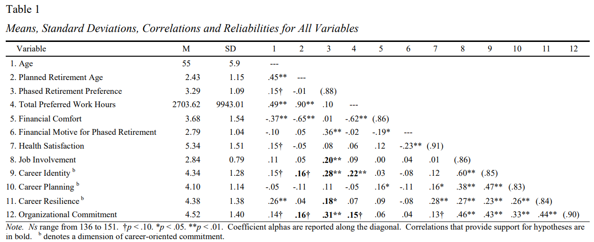
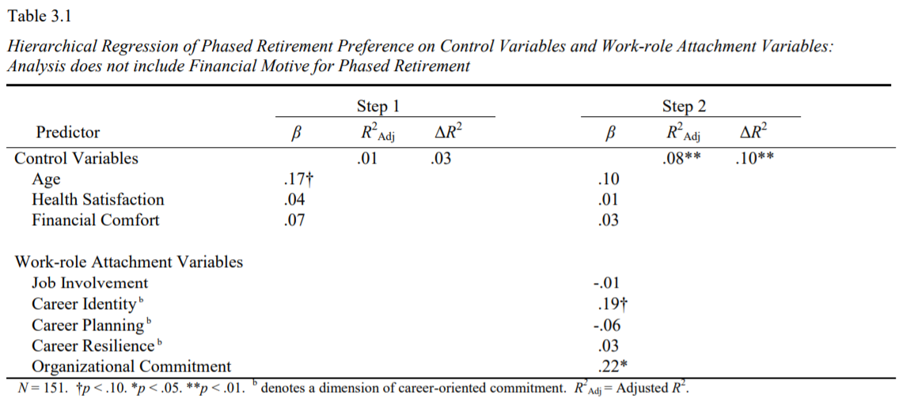

# Phased Retirement can be used to Retain Valued Employees

## Introduction
Phased retirement occurs when a worker transitions from full-time to part-time employment for an organization before completely and permanently retiring from the workforce. Phased retirement carries benefits for the individual worker, as well as the organization. For the employee, phased retirement allows the worker to gradually gain familiarity with the retirement lifestyle while maintaining desirable work contacts, daily structure, and professional status associated with a long-term career job. For the employer, phased retirement may assist with succession planning and help prevent skill shortages and the loss of institutional knowledge by allowing employees to continue working part-time when they no longer wish to work full-time.

I hypothesized that workers with stronger commitment to their jobs, organization, and career would be more likely to continue working past their planned retirement age in a phased retirement program. I collected data from 151 Ohio University employees via online survey. Data were analyzed with SPSS and Excel. Analyses included correlation, hierarchical regression, Williams *t* tests, and a post-hoc statistical power analysis.

## Results
Results generally supported my hypotheses. For example, after controlling for age, health, and financial comfort, a hierarchical regression analysis revealed that work role attachment variables collectively explained an additional 10% of the variation in preferences to extend careers through phased retirement, &Delta;*F*(5, 142) = 3.34, p < .01, &Delta;*R_Squared* = .10.

This result supports the idea that phased retirement may be used as a tool to retain dedicated workers when they are no longer willing or able to continue working full-time.

